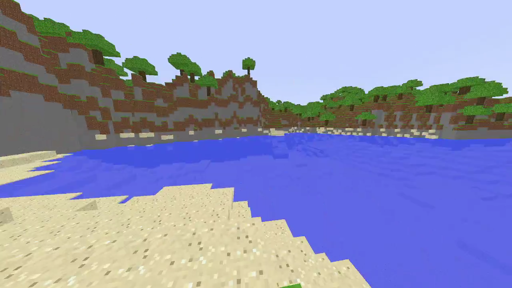

# minecraft_rust

Hello, this is my personal project in opengl, recreating main concepts of minecraft in rust. 
Its hard work. Started on 22-03-2021. Main inspiration was the video how a guy made minecraft 
from strach in c using opengl. Looked hard, so i decided to one up and do it in rust. It was very difficult.

# Setup 
For Glium version:

No setup required.

For raw opengl version:

Follow this tutorial http://nercury.github.io/rust/opengl/tutorial/2018/02/08/opengl-in-rust-from-scratch-00-setup.html. It's what i used to set up the opengl environment in Rust. Very important, install sdl2 library on your system the way it is shown in the tutorial on the second page.

# 17-04-2021

Made a rendering system that uses chunks. Chunks have blocks in them. Rn its just static, meaning chunks are not unloaded when far away. But that is going to be the next thing I work on.

# 24-04-2021

Made a chunk load and unload based on distance to camera. Was harder than expected, had to reconsider how to gererate chunks. I think this feature is going to be an issue in the future.

# 30-04-2021

Due to the massive performance draw of rendering all of those blocks some cutting down on unneeded polygons was needed. I added some features that check if any blocks are next to each block. If the block says it is at the end of a chunk or an air block is next to it, then the face of the block shows, othervise if there are normal blocks next to it, it doesn't render the face. Feature might break later as im not exactly sure about the generation of chunks yet.

# 01-05-2021

Implemented some terrain generation. Found out that my ways of rendering the blocks are not very efficient, will need to work on that a lot. Maybe move to glium instead of gl-rs aswell.

# 15-05-2021

After around 15 hours of refactoring I implemented a new way of rendering the terain. In chunks instead of each block individualy. This is much more efficient and makes the game playable. In addition to this is I finally got the hang of the noise functions so I made some terrain to go with these new features. It looks very nice now and was worth the effort.

Fixing the terrain and performance was not enough so i added block breaking just to be icing on the cake. Works pretty good, there are some invisible polygons appearing sometimes when the block is being broken. I do not know exactly what causes these, it seems like there is something i'm not cleaning up when rerendering the chunk after edit. Cant find it, doesnt cause problems, it's an issue for later.

I also added smooth motion of the player camera.

Here you can see some edited terrain.

# 16-05-2021

Added placing blocks and multiple block types.

# 31-05-2021

Added some cheat lighting of objects that will be probably changed later. Now eveything doesnt look like a smear.
Added water that is transparent. Made it be slightly lower than the normal blocks and it looks super nice.
Added propper transparency by seperating rendering of the transparent blocks from the solid blocks. I though this was going to be a hard task, since blending is supposed to be very hard to do propperly, but it was very nice getting it on the first try without sorting.

# 19-06-2021

Added rendering of new chunks when the camera is moving. Had a lot of trouble with this one because i had made mistakes earlier in how i render objects. New chunks are generated by shifting the entire chunk vector to one direction and then reconstructing one of them. Only block id's and positions are changed to improve performance. All of this is done without copying the chunks. The performance impact is big if the chunks are of size 16. I will have to improve it after i fix some more bugs with the rest of the source code.

Bug of only being able to break the blocks in a circle around the chunk position has been fixed.

# 30-07-2021

Added more player interaction with the world. The player now can collide whith the visible blocks. Can jump. Water effects the players movement speed and the jump functionality. The player cant place a block on himself.

# 06-08-2021 

Added trees with leaves. Added more interesting terrain that has more diversity in landscape. Added a block hashmap which saves the blocks that were changed by the player, when the chunk is loaded again the blocks are there. Tree leaves are a bit buggy accross chunks, the chunk beside tree has in memory the leaves but it needs to be regenerated to include those leaves. Will fix that next time.

From here the project will mainly have performance tweaks and bug fixes. Unless some features come to my mind and i have the time to implement them. Thank you for reading.

# 17-09-2021 

The game now has way less bugs. There are still a lot of very small bugs though. Added biomes. Added frustum culling to improve performance. Added threading when building chunks. Added bilinear interpolation between chunk blocks, may be replaced by bicubic later. A lot of smaller things got added that i dont remember. 

Im donne adding things for now. The game of mine is a bit less performance efficient than similar projects but that is ok for me. I feel like the game is a sligtly enchanced version of the classic minecraft that was on the minecrat.net website in 2011. It has been a very fun project. I will probably come back in a year to put some more imporvements to gameplay on it, small things.

# 29-01-2022 

Swapped raw Opengl and sdl2 for Glium and Glutin. Raw open gl was broken when compiling in release mode. Glium fixed this by reducing the complexity of opengl setup.
This change did reduce some performance mostly in draw call, performance in the creation of chunks had a 10 time speed increase when compiled with release. Changes in the future easier and adding of more features much more simple. The program has also been changed to run full screen on startup.

# 09-04-2022

Added random seed generation for the map. I tested the game on a ryzen 7 5700U and it really liked having a lot of physical cores to work with, chunks rendered instantly. 

# 30-04-2024

Recorded a longer video of how the game plays. YT link: https://www.youtube.com/watch?v=750gszmbb3U.

